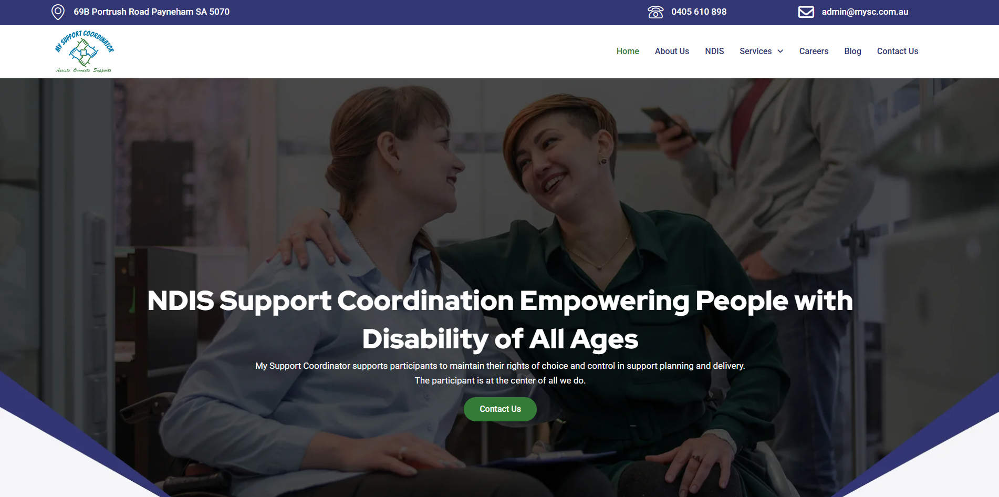

# My Support Coordinator

**Client:** 10X Digital Group Australia  
**Website:** [mysc.smartscriptstech.com](https://mysc.smartscriptstech.com)  
**Technology Stack:** PHP, MySQL, WordPress, Elementor, Astra Theme  
**Industry:** Disability Services / NDIS Provider  
**Location:** Australia  

### 🏢 About the Client

**Mr. Hitesh Kangariya** contacted us with a dream to create a solid online presence for his **NDIS** support service business. Being an approved NDIS service provider, the client needed a professional and accessible website to showcase their values of care, support, and community inclusion.

The goal was to create a business website that is informative, aesthetically pleasing, and constructed to foster trust and interaction among individuals and families looking for NDIS services in Australia.
### 🎯 Project Goals

- Create a modern, clean website that clearly conveys NDIS services
- Make it simple for visitors to discover support options and contact you
- Ensure mobile responsiveness and SEO-friendly design
- Keep it fast-loading, secure, and easily manageable

### 🚧 Challenges

The main challenge with this project was design. The site had to balance professionalism with warmth, and be accessible and inclusive for all potential users, including families with disabilities and their families. Furthermore, NDIS service websites are required to generate trust, simplicity, and compliance—all without becoming too clinical or corporate.

### 💡 Our Solution
To achieve the client's objectives and overcome design difficulties, we constructed the website employing:

- WordPress CMS for simplicity and scalability
- Elementor for adaptable, visually appealing page construction
- Astra Theme for speed, customizability, and minimalist design
- PHP & MySQL for backend functionality and consistent performance

We worked closely with Mr. Hitesh to get a sense of the tone of the brand and target audience. Based on his feedback, we designed a website that includes:

- Easily segmented service pages with in-depth information
- Effective calls-to-action for simple enquiries
- A soothing and accessible color scheme with clear typography
- Contact forms and rapid navigation to improve user experience
- SEO-friendly design to enhance search engine visibility

**Major Features Implemented**
- Responsive design for all devices
- Contact forms with location-based information
- Informative homepage to identify core services
- Testimonials and trust indicators to improve credibility
- Accessibility-aware design to comply with NDIS guidelines
### 📈 Results
The outcome was a clean, easy-to-use website that clearly expresses the values and services of the business. The client has a professional online portal to promote his NDIS services, receive more enquiries, and cater to more users in Australia.

**Client Testimonial**
"**Smartscripts** did just what I had in mind—clean, professional, and spot on for the NDIS audience. The team was attentive, innovative, and dedicated to quality throughout the process."
— **10X Digital Group** Australia
